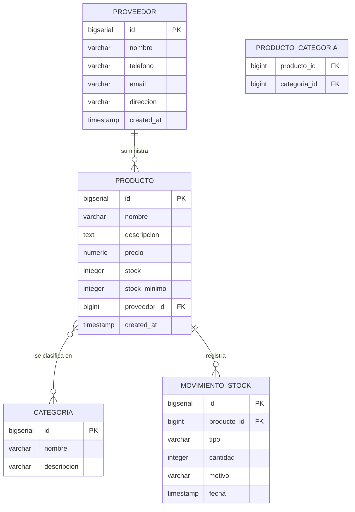

# Diagrama Entidad-Relacion (DER)

Sistema de inventarios StockWise. Cumple con los requisitos del proyecto:
relaciones 1:N y N:M mapeadas en JPA/Hibernate.

## Resumen de relaciones

| Origen | Cardinalidad | Destino | Tipo |
|---|---|---|---|
| proveedor | 1 — N | producto | 1:N |
| producto | N — M | categoria | N:M (tabla puente `producto_categoria`) |
| producto | 1 — N | movimiento_stock | 1:N |

## Diagrama (Mermaid)

## Reglas de integridad clave

- Un producto **siempre** pertenece a un proveedor (`proveedor_id NOT NULL`).
- Eliminar un proveedor con productos asociados esta restringido (`ON DELETE RESTRICT`).
- Eliminar un producto **propaga** la baja a sus categorias y movimientos (`ON DELETE CASCADE`).
- `tipo` de `movimiento_stock` solo acepta `ENTRADA` o `SALIDA` (CHECK constraint).
- `precio >= 0`, `stock >= 0`, `cantidad > 0` validados por CHECK.
